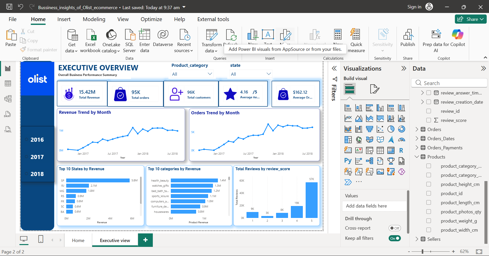
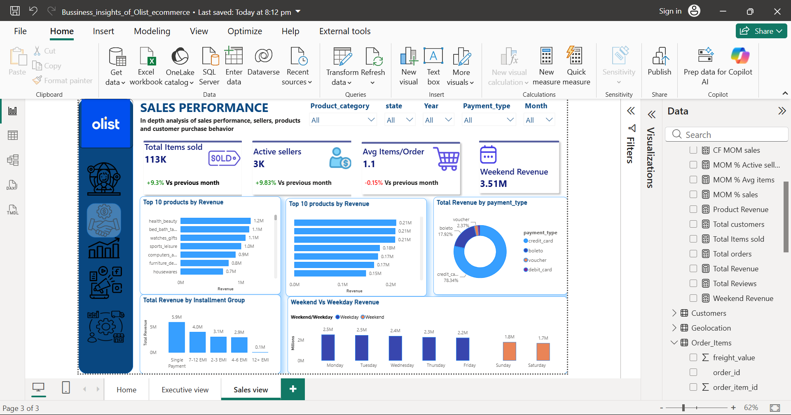
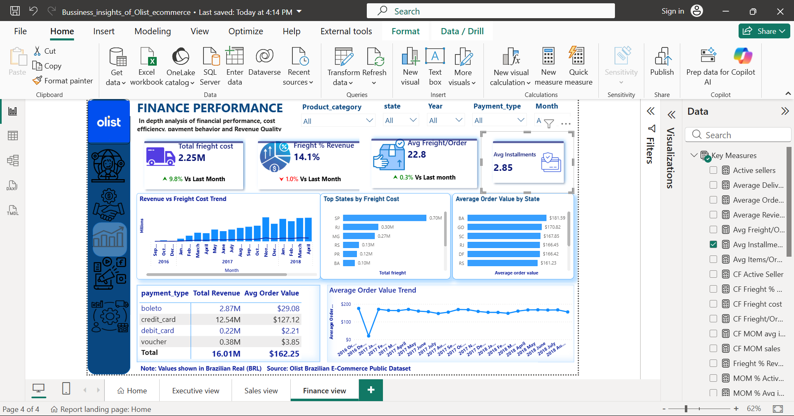
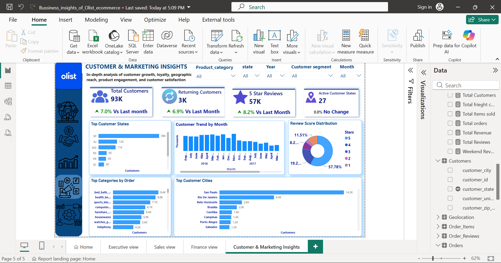
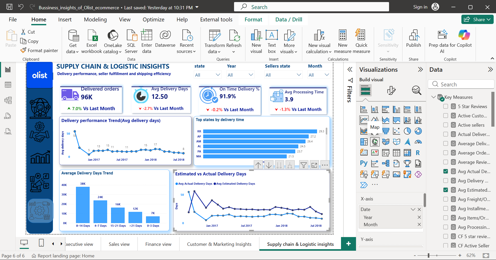
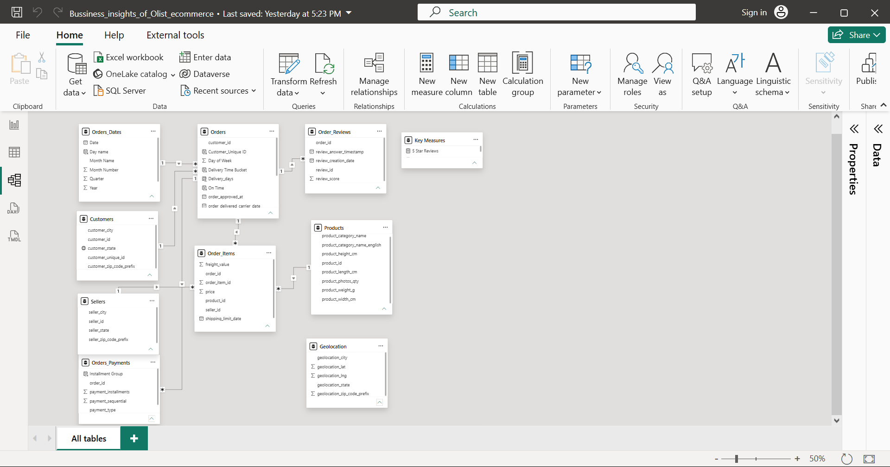

# 🛒 Olist Business Insights 360

### Turning Brazilian E-Commerce Data into Actionable Business Decisions
> A business-focused Power BI analytics project built using the
> Brazilian E-Commerce Public Dataset by Olist.

##  Project Overview

This is my first full-fledged Power BI project using a public dataset.

The objective was not simply to create charts, but to approach the dataset from a business perspective — identifying important business problems, framing relevant questions, analyzing the data, and translating the findings into actionable recommendations.

Using the Brazilian E-Commerce Public Dataset by Olist, I developed a Business Insights 360 dashboard covering:

- Overall business performance
- Sales and product performance
- Financial performance
- Customer and marketing insights
- Supply chain and logistics performance

The dashboard is designed to help business stakeholders move from raw data to meaningful decisions.

##  Business Problem

E-commerce businesses generate large volumes of transactional, customer, product, payment, review, and logistics data.

However, raw data alone does not answer important management questions such as:

- Are sales growing consistently?
- Which products and categories drive revenue?
- How efficiently is revenue being generated?
- Who are our customers and where are they concentrated?
- Are customers satisfied with their purchases?
- Are orders being delivered on time?
- Which regions experience longer delivery times?
- Where are the biggest operational opportunities?

The objective of this project was to bring these perspectives together into a single Business Insights 360 dashboard.

##  Business Questions

### Executive
- What is the overall health of the business?
- How are revenue, orders, customers and reviews trending?

### Sales
- Which products and categories generate the most revenue?
- Which payment methods contribute most to revenue?
- How does customer purchasing behavior vary across weekdays and weekends?

### Finance
- How efficiently is revenue being generated?
- What is the relationship between revenue and freight costs?
- Which categories and regions have stronger financial performance?

### Customer & Marketing
- Where are customers geographically concentrated?
- Which product categories attract the highest customer demand?

  ##  Tools & Technologies

| Tool | Purpose |
|---|---|
| Power BI Desktop | Dashboard development and visualization |
| Power Query | Data cleaning and transformation |
| DAX | KPI and business measure creation |
| Data Modeling | Relationships and analytical structure |
| Excel | Data documentation and supporting analysis |
| GitHub | Project documentation and portfolio management |
- What does the review distribution tell us about customer satisfaction?

### Supply Chain & Logistics
- How long does it take to deliver customer orders?
- Which states experience the longest delivery times?
- What percentage of orders are delivered on time?
- Are actual delivery times better or worse than estimated delivery times?
- How efficiently are orders processed before shipping?

- ##  Dashboard Overview

The dashboard is organized into five analytical perspectives, supported by a dedicated landing page for navigation.

### 1️⃣ Executive Overview

Provides management with a high-level view of:

- Total Revenue
- Total Orders
- Total Customers
- Average Customer Rating
- Average Order Value
- Revenue and order trends
- Top-performing states
- Top-performing product categories
- Review distribution

  ### 2️⃣ Sales Performance

Focuses on sales drivers and customer purchasing behavior.

Key analysis includes:

- Product and category revenue
- Active sellers
- Items sold
- Average items per order
- Payment method contribution
- Installment behavior
- Weekend vs weekday revenue

  ### 3️⃣ Finance Performance

Evaluates revenue efficiency and cost behavior through:

- Revenue performance
- Freight cost analysis
- Order economics
- Payment behavior
- Profitability indicators
- Cost trends and financial efficiency

  

  ### 4️⃣ Customer & Marketing Insights

Answers:

- Where are customers concentrated?
- Which states and cities have the largest customer base?
- Which categories attract the highest customer demand?
- How is customer activity changing over time?
- What does customer review distribution indicate about satisfaction?

  

  ### 5️⃣ Supply Chain & Logistics Insights

Focuses on operational efficiency:

- Delivered orders
- Average delivery days
- On-time delivery %
- Average processing time
- Delivery performance trends
- Regional delivery performance
- Delivery-time distribution
- Estimated vs actual delivery performance

## 🔍 Key Business Insights

### Business Performance
- Revenue and order volumes show a strong overall growth pattern across the analyzed period.
- A small number of states contribute a significant share of total revenue and customers.

###  Sales
- Health & Beauty and other leading categories contribute strongly to overall revenue.
- Credit cards represent the dominant payment method.
- Weekday purchasing contributes more revenue than weekend purchasing.

### Customers
- São Paulo represents the largest customer concentration.
- Customer demand is concentrated across a relatively small number of major cities.
- 5-star reviews represent the largest share of customer feedback.

###  Logistics
- Overall on-time delivery performance is strong.
- Delivery time varies significantly by state.
- Some regions experience substantially longer average delivery times and may require operational attention.
- Actual delivery performance generally remains below estimated delivery time, indicating that customer delivery expectations are being met effectively.

  ## 💡 Recommendations

### 1. Prioritize high-potential regions
Focus sales and marketing initiatives on states and cities with strong customer concentration and revenue contribution.

### 2. Optimize regional logistics
Investigate states with significantly higher delivery times and evaluate opportunities for better logistics partners, fulfillment locations, or shipping routes.

### 3. Reduce order processing time
Identify sellers or operational areas with longer processing times and introduce fulfillment performance monitoring.

### 4. Strengthen high-performing categories
Use category-level performance to prioritize inventory, promotions, and marketing investment.

### 5. Leverage customer feedback
Use review scores and customer behavior to identify areas where product quality or service experience can be improved.

### 6. Monitor delivery promise accuracy
Continue comparing estimated and actual delivery performance to maintain customer trust and improve delivery-time forecasting.

##  Expected Business Impact

The analysis can support management in:

- Improving sales and category prioritization
- Identifying high-value markets and customer segments
- Improving delivery reliability
- Reducing operational bottlenecks
- Improving customer satisfaction
- Supporting data-driven logistics planning
- Improving resource allocation across regions
- Monitoring business performance from a single analytical view

  ##  Data Model

The project uses a relational data model connecting customer, product, seller, order, payment, review, and geographic information.

The model was designed to support analysis across:

- Sales
- Customers
- Products
- Payments
- Reviews
- Sellers
- Delivery
- Geography

##  Data Preparation

Power Query was used to prepare the raw Olist datasets before analysis.

Key preparation activities included:

- Data type correction
- Column selection and renaming
- Handling missing values
- Date and time transformations
- Product category translation
- Creating delivery-related calculations
- Preparing analytical fields
- Structuring data for Power BI modeling

  ## 🔗 Connect with Me

**LinkedIn:** *(www.linkedin.com/in/jayalalitha-t)*

